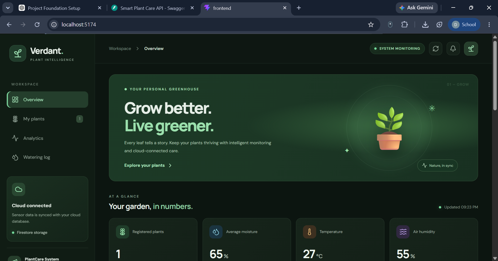
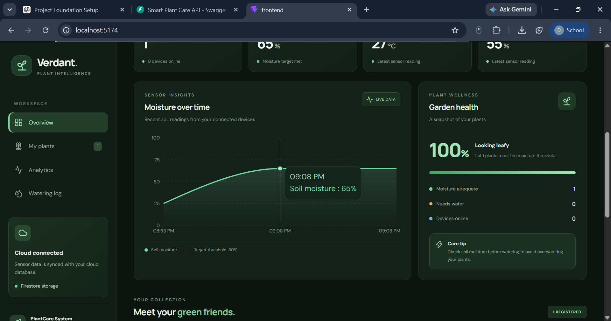
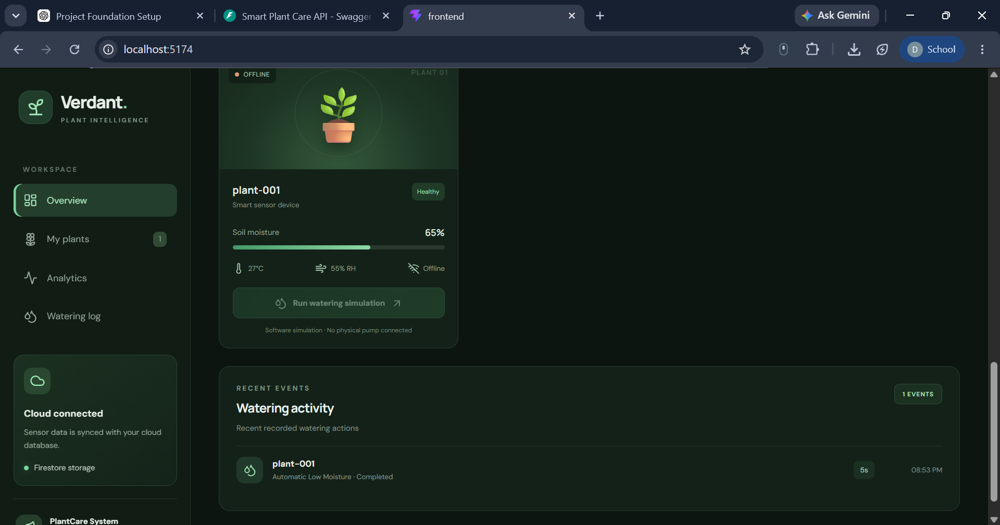
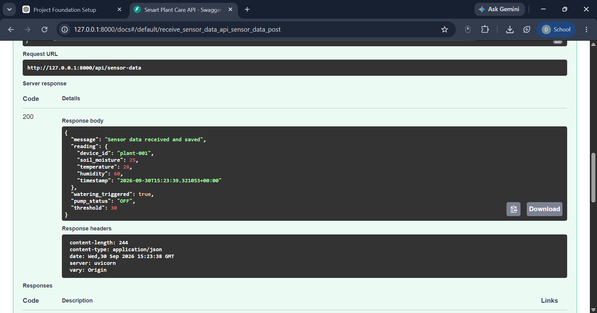
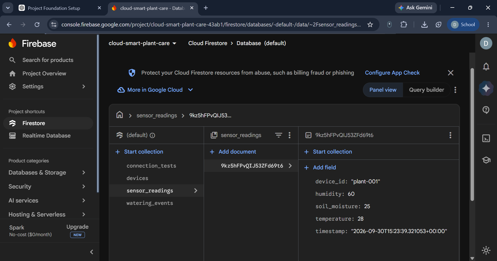
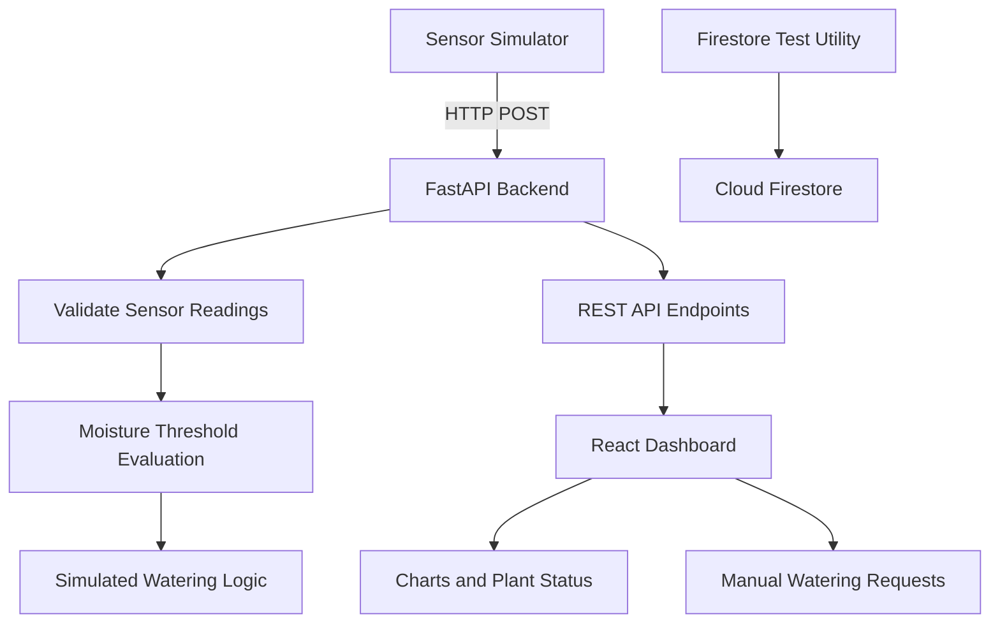

# 🌱 Cloud-Connected Smart Plant Care

A web-based smart plant monitoring and automated watering prototype that receives sensor readings through a REST API, monitors soil moisture, and simulates watering actions when plants need attention.

The project combines a **FastAPI backend, React dashboard, Python sensor simulator, and Firebase Firestore connectivity utilities** to demonstrate a cloud-oriented IoT plant-care workflow.

## 📸 Project Screenshots

### Dashboard Overview



### Soil Moisture and Plant Health



### Watering Activity



### Sensor Data and Cloud Connectivity





## 🎯 Problem Statement

Monitoring plants manually can make it difficult to maintain consistent soil moisture, especially when caring for multiple plants or when regular monitoring is not possible.

This project demonstrates how sensor readings, backend processing, and a centralized dashboard can help users monitor plant conditions and trigger watering actions based on soil moisture thresholds.

## ✨ Key Features

* **Sensor data ingestion:** Receive soil moisture, temperature, and humidity readings through a REST API.
* **Plant health monitoring:** Display recent readings and indicate whether a plant needs water.
* **Automatic watering simulation:** Trigger a simulated watering action when soil moisture falls below a configurable threshold.
* **Manual watering controls:** Allow users to request watering through the dashboard.
* **Watering event tracking:** Record watering events, including timestamps, reasons, and simulated duration.
* **Interactive dashboard:** Visualize plant readings, moisture trends, device status, and watering activity.
* **REST API:** Expose endpoints for readings, device status, configuration, and watering operations.
* **Firestore connectivity utility:** Include a Firebase Admin SDK helper and a test script to verify Firestore connectivity.

> **Implementation note:** The watering mechanism is simulated; it does not directly control a physical water pump. Firestore connectivity has been tested separately. Unless Firestore persistence has been integrated into the sensor API, application readings and watering events are stored in backend memory and are not retained across backend restarts.

## 🛠️ Technology Stack

| Component                   | Technologies                        |
| --------------------------- | ----------------------------------- |
| Frontend                    | React, JavaScript, Vite             |
| Styling                     | CSS                                 |
| Data visualization          | Recharts                            |
| Icons                       | Lucide React                        |
| Backend                     | Python, FastAPI, Pydantic           |
| API server                  | Uvicorn                             |
| Cloud database connectivity | Firebase Admin SDK, Cloud Firestore |
| Development and testing     | Git, GitHub, Swagger UI             |

## 🏗️ System Architecture



The sensor simulator sends readings to the backend. FastAPI validates the input, evaluates soil moisture, and exposes readings and watering events through REST endpoints. The React dashboard retrieves these endpoints and presents the information to the user.

The Firestore test utility verifies cloud database connectivity independently of the in-memory application workflow.

## 📂 Project Structure

```text
cloud-connected-smart-plant-care/
├── backend/
│   ├── app/
│   │   ├── main.py
│   │   └── firebase_db.py
│   ├── simulator.py
│   ├── test_firestore.py
│   └── requirements.txt
├── frontend/
│   ├── public/
│   ├── src/
│   │   ├── App.jsx
│   │   └── index.css
│   ├── package.json
│   └── package-lock.json
├── screenshots/
├── .gitignore
└── README.md
```

## ⚙️ Prerequisites

Install the following before running the project:

* Python and pip
* Node.js and npm
* Git
* A Google Cloud project with Cloud Firestore configured, if you want to run the Firestore connectivity test

## 🚀 Getting Started

### 1. Clone the repository

```bash
git clone YOUR_GITHUB_REPOSITORY_URL
cd cloud-connected-smart-plant-care
```

Replace `YOUR_GITHUB_REPOSITORY_URL` with your actual GitHub repository URL.

### 2. Set up the backend

From the project root, create and activate a Python virtual environment.

**Windows PowerShell:**

```powershell
python -m venv backend/.venv
.\backend\.venv\Scripts\Activate.ps1
```

Install the backend dependencies:

```powershell
pip install -r backend/requirements.txt
```

Configure Firebase credentials only if using the Firestore utility. Place your downloaded service-account key at:

```text
secrets/firebase-key.json
```

Set the credentials environment variable:

```powershell
$env:GOOGLE_APPLICATION_CREDENTIALS = (Resolve-Path ".\secrets\firebase-key.json").Path
```

Start the FastAPI server from the project root:

```powershell
python -m uvicorn app.main:app --reload --app-dir backend --host 127.0.0.1 --port 8000
```

The backend will be available at:

* API base: `http://127.0.0.1:8000`
* Interactive API documentation: `http://127.0.0.1:8000/docs`
* Health check: `http://127.0.0.1:8000/health`

### 3. Set up the frontend

Open a second terminal:

```powershell
cd frontend
npm install
npm run dev
```

Open the local URL printed by Vite in your terminal, usually `http://localhost:5173` or another available port.

Keep the backend running while using the dashboard.

### 4. Generate sample sensor readings

Open a third terminal from the project root and activate the virtual environment if needed.

Run the sensor simulator:

```powershell
python backend/simulator.py
```

The simulator sends sample sensor readings to the backend. Keep it running if it continuously generates readings.

Refresh the dashboard to view the latest data.

### 5. Test Firestore connectivity (optional)

After configuring your Google Cloud project, enabling the Firestore API, creating a Firestore database, and setting the credentials environment variable, run:

```powershell
python backend/test_firestore.py
```

A successful test confirms that the utility can write a test document to the configured Firestore database. It does not, by itself, confirm that the sensor API persists its readings to Firestore.

## 🔌 API Endpoints

The backend exposes the following endpoints:

| Method | Endpoint                 | Description                       |
| ------ | ------------------------ | --------------------------------- |
| GET    | `/`                      | Basic API information             |
| GET    | `/health`                | Check backend health              |
| POST   | `/api/sensor-data`       | Submit a sensor reading           |
| GET    | `/api/readings`          | Retrieve recent readings          |
| GET    | `/api/status`            | Retrieve device and plant status  |
| GET    | `/api/watering-events`   | Retrieve watering event history   |
| POST   | `/api/water/{device_id}` | Request manual simulated watering |
| GET    | `/api/config`            | Retrieve watering configuration   |

Use `http://127.0.0.1:8000/docs` to inspect endpoint schemas and test API requests interactively.

### Example sensor payload

```json
{
  "device_id": "plant-01",
  "soil_moisture": 24,
  "temperature": 28,
  "humidity": 62
}
```

Submit this JSON body to `POST /api/sensor-data` with the `Content-Type: application/json` header.

The example values are illustrative. The backend evaluates soil moisture against its configured threshold.

## 🔐 Security Notes

* Never commit Firebase service-account JSON files or other credentials.
* Keep `secrets/` and environment files excluded through `.gitignore`.
* Use environment variables for credential paths.
* Do not publish private keys, passwords, access tokens, or other secrets in screenshots or source code.
* Restrict cloud database access using appropriate IAM permissions.

## 🔮 Future Enhancements

* Persist sensor readings and watering events in Firestore.
* Integrate physical soil-moisture sensors and a relay-controlled water pump.
* Add real-time updates using a suitable streaming mechanism.
* Support multiple plants and configurable moisture thresholds.
* Add historical analytics, alerts, and watering schedules.
* Introduce authentication and role-based access control.
* Deploy the frontend and backend to cloud hosting.

## 🎓 Learning Outcomes

This project provides practical experience with:

* Building REST APIs using FastAPI
* Developing interactive interfaces with React
* Connecting frontend applications to backend services
* Validating sensor data and implementing threshold-based logic
* Visualizing time-series readings
* Configuring Firebase Admin SDK and testing Firestore connectivity
* Using Git and GitHub for project version control

## 👩‍💻 Author

**DHARSHINI Raja**

Student Developer | Computer Science and Engineering

---

If you find this project useful, feel free to explore the code, test the API, and build on the prototype.
